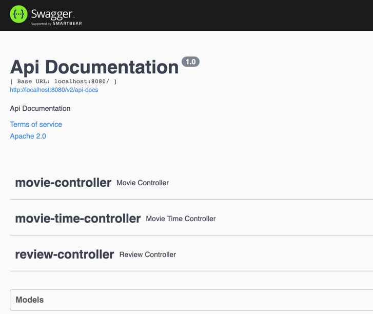

# Furious API

## Technologies used
- Kotlin 1.5.31
- SpringBoot
- Reactive Programming using Kotlin Coroutines and Spring WebFlux
- Arrow-kt
- PostgreSQL
- Redis
- Junit 5 Juniper
- Mockk
- Wiremock
- Testcontainers

## Architectural and Technical Decisions

### Architecture

The project is created using the "ports and adapters architecture", also known as "hexagonal architecture".

With this architecture, the code is organized into layers: logic, controllers, adapters and ports.

I'm using it because it provides an easy way of understanding what the code is doing and benefits a more functional approach, 
also improves readability and testability of the code. 

#### logic

The classes inside logic package deals with pure business logic and must not have side-effects or throw exceptions.

#### adapters

A layer to convert external data to internal ones, and vice-versa. The domain that is exactly the same as the external data should not have an adapter.
The point is if the outside world changes, you only have to change the adapter, or creating a new one for the domain that does not have it.

#### ports

The classes inside ports package communicates with the outside world, such as http, redis, postgres.

#### controllers

The classes inside the package controllers are the glue between all the other layers, orchestrating calls between pure business logic, adapters, and ports.

### Error Handling

I'm using arrow-kt `Either` for functional error handling in order to try to avoid exceptions to be thrown, 
because exceptions break referential transparency and are not consistent.
The `Either` also let the code more readable because it is clear what a call can actually return.

### Reactive Programming

I'm using kotlin Coroutines because this is an IO first api, 
meaning the majority of operations that the api is performing are IO calls. 
With that, the Coroutines have the ability to make the api more scalable.


### Next Steps I would like to do

1. Add spring security to prevent customers to do add movie times using roles (customer, owner)
2. Add retry and circuit break in the api call

## Instructions on how to run the API

1. To run the api in a local environment, is necessary to have installed the following resources:
  - Docker
  - Docker-Compose
  - Java 11
  

2. With the resources installed, execute the command, on the app root folder:

  ```
    $sh run.sh {api-key}
  ```


## Swagger and api usage

The api has swagger installed and can be accessed in the link :`http://localhost:8080/swagger-ui/`




